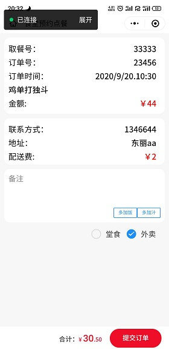
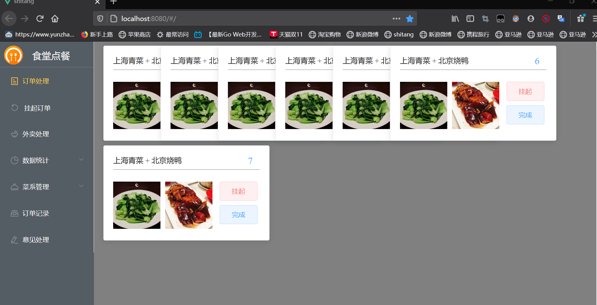
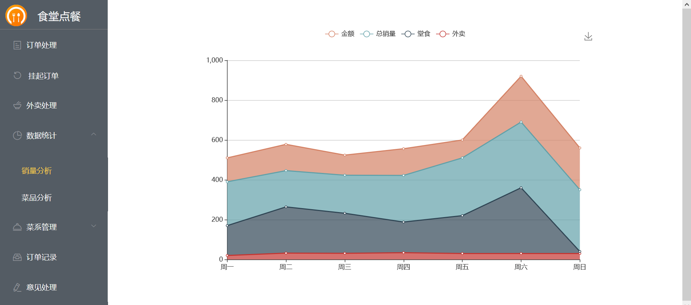

# CanteenAppointment
## 项目名称：食堂预约点餐
## 主要技术
**微信端**:
vant 
**前端**:
vue.js，element UI，axios 
**服务端**:
go，gin，gorm,mysql
## 目前进度
PC端与后端交互完成
微信端未实现接口接入
## 项目需求 
通过微信小程序预约食堂订单，通过减少支付流程，提前准备，缩短排队时间，同时提供外卖服务。
## 项目说明
**diningApplets** 
微信端:安装node环境，导入vant 
**front**
PC前端:安装node，npm vue，element ui，axios. 运行npm run serve 
**dining**
后端:安装go1.13以上，go get 相关的库
## 项目预览

